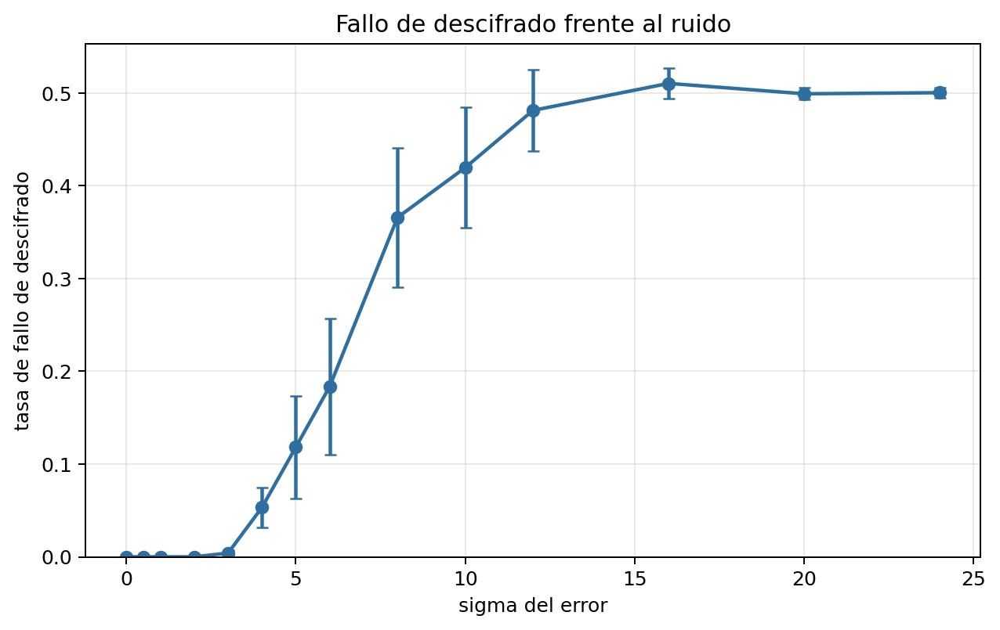
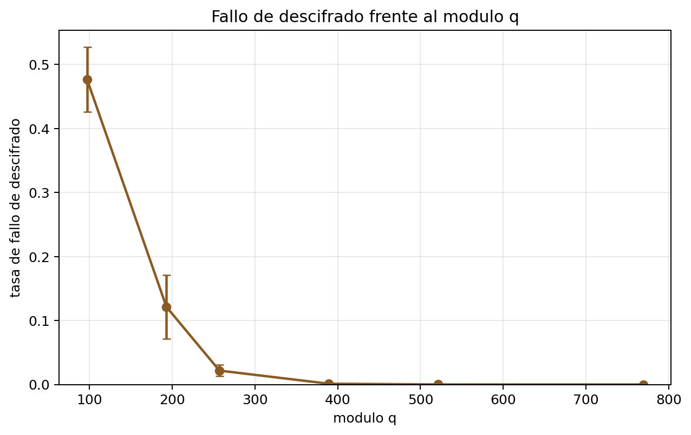
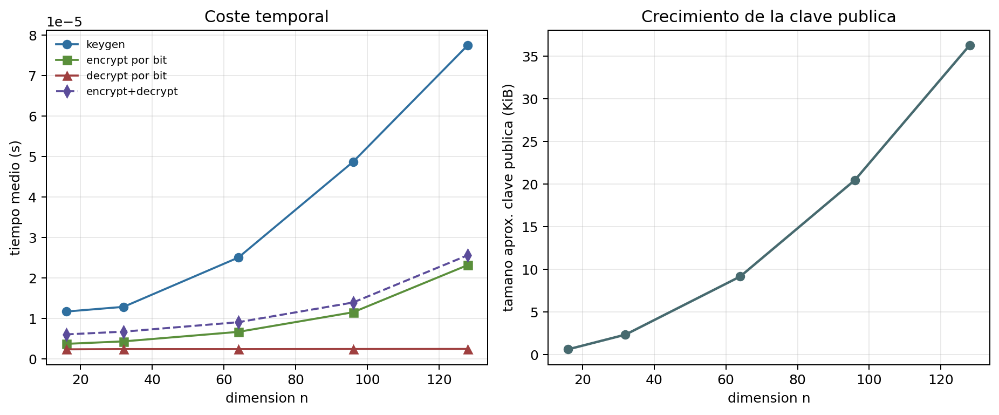
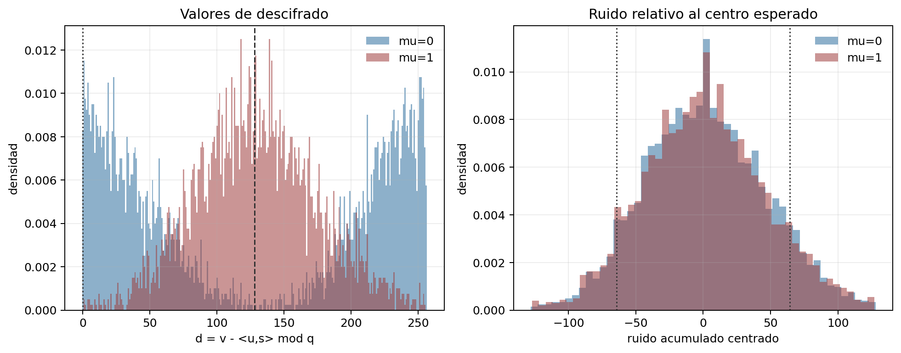

# LWE Crypto Lab — Empirical study of a Regev-style LWE cryptosystem

[](https://www.python.org/)
[](./LICENSE)

A from-scratch, reproducible implementation of a simplified **Learning With
Errors (LWE)** encryption scheme (Regev-style), built for my Bachelor's
thesis (TFG) in Mathematical Engineering. The thesis studies why post-quantum
cryptography (NIST's ML-KEM/Kyber, ML-DSA/Dilithium, FrodoKEM) is built on
LWE instead of RSA or elliptic curves, and this repo makes the key claim —
*noise is what makes LWE hard* — visible and measurable instead of just
asserted.

## Headline result: noise is what makes LWE hard

The repo includes a working **key-recovery attack**: exact Gaussian
elimination over `Z_q` applied to the public key `(A, b = As + e mod q)`.

| | `σ = 0` (no noise) | `σ = 4` (noise) |
|---|---|---|
| Decryption success rate | 100.0% | 95.85% |
| **Secret fully recovered by linear-algebra attack** | **100% of runs** | **0% of runs** |

With zero noise, `b = As mod q` is a linear system — solvable exactly, every
time, in polynomial time. Add a small Gaussian error term and the same
attack fails on every single trial, while decryption still works 95.85% of
the time. That gap *is* the LWE hardness assumption, demonstrated
empirically. (`n=64, q=257`, 30 repeats × 1,000 trials, see
[`src/results/comparison_noise_summary.csv`](./src/results/comparison_noise_summary.csv).)

## Why noise, and why it has to be calibrated

For a ciphertext `(u, v)`, decryption computes `d = v − ⟨u, s⟩ mod q`. The
secret cancels out algebraically and what's left is the identity:

```
d = e·r + μ·⌊q/2⌋  (mod q)
```

— pure accumulated noise plus the encoded bit. Decryption picks `μ=0` if
`d` is close to `0`, or `μ=1` if `d` is close to `q/2`; it fails once the
noise crosses the margin `q/4` that separates the two regions.

With `m = 2n` samples and independent random `r ∈ {0,1}^m`, the accumulated
noise `e·r` has standard deviation `σ·√(m/2) = 8σ` for this repo's default
`n=64`. So the correctness condition is:

```
σ ≪ q / (4·√(m/2))
```

At the base parameters (`n=64, q=257, σ=3`) that's `24 ≪ 64` — comfortably
inside the safe window. This is exactly the tension LWE is built on: too
little noise and the linear structure stays exposed (attackable); too much
noise and even the legitimate receiver can't decrypt reliably.

## What this is — and isn't

This is a **didactic, simplified** implementation, not a production scheme:
no ring/module structure, no NTT, no CCA-secure encapsulation (Fujisaki–
Okamoto), no side-channel protection, bit-by-bit encryption only. It does
**not** implement Kyber, Dilithium, or FrodoKEM. The goal, shared with the
thesis, is to isolate one question — *how do `σ`, `q` and `n` govern
decryption correctness, cost, and key size?* — and answer it with
measurements, not hand-waving.

## Experimental results

All experiments use `n=64, q=257` unless swept, 30 independent repeats per
setting, 1,000 encryptions per repeat, 95% CIs via the normal approximation.
Raw data and full parameter grids are in [`src/results/`](./src/results).

**1. Decryption failure vs. noise level `σ`** (fixed `q=257`) — the central
result of the thesis: a sigmoidal window between "resolvable linear system"
and "pure guessing".



| σ | 0–2 | 3 | 4 | 5 | 6 | 8 | 10+ |
|---|---|---|---|---|---|---|---|
| Failure rate | 0.0% | 0.4% | 5.3% | 11.8% | 18.4% | 36.6% | ~50% (coin flip) |

Below `σ≈3` the noise stays well under the `q/4=64` threshold and decryption
is essentially perfect — but the scheme is also at its weakest, closest to
the noiseless, exactly-solvable case. Past `σ≈16` the failure rate
converges to 50%: not "the system breaks half the time" but the decoder
having no useful signal left, equivalent to a coin flip.

**2. Decryption failure vs. modulus `q`** (fixed `σ=4`, the transition zone
from experiment 1) — increasing `q` widens the `q/4` margin without moving
the noise:



| q | 97 | 193 | 257 | 389 | 521 | 769 |
|---|---|---|---|---|---|---|
| Failure rate | 47.7% | 12.1% | 2.2% | 0.12% | 0.003% | 0.0% |

At `q=97`, `q/4≈24` is smaller than the noise's own standard deviation
(`32` at `σ=4`), so the failure rate sits near 50% — the margin is simply
too tight. Growing `q` isn't free, though: every modulus increase costs
`⌈log₂ q⌉` more bits per element, which is exactly why real schemes cap `q`
and rely on structure (Module-LWE) instead of raising it indefinitely.

**3. Cost & public key size vs. dimension `n`** (fixed `q=257, σ=2`) — the
concrete reason real schemes don't use plain LWE:



| n | 16 | 32 | 64 | 96 | 128 |
|---|---|---|---|---|---|
| Public key size | 612 B | 2.3 KB | 9.1 KB | 20.5 KB | 36.3 KB |

Grows quadratically (`2n²⌈log₂ q⌉` bits) — key generation and encryption
scale the same way, decryption stays ~O(n). This is precisely why ML-KEM
and ML-DSA use Module-LWE with NTT-based multiplication (O(n log n) instead
of O(n²)) rather than unstructured LWE.

**4. Distribution of the decryption value `d`** — the geometry behind the
failure rate: how the `μ=0` and `μ=1` regions separate (or overlap) around
the `q/4` decision boundary, averaged over 40 independent keys to cancel
the bias a single fixed key's error vector introduces:



## Repository structure

```
.
├── TFG_LWE.pdf                 # full written thesis (Spanish, 78 pages)
├── presentacion_LWE.pptx       # defence slides
├── src/
│   ├── lwe_scheme.py            # LWEScheme: keygen / encrypt / decrypt + the linear-algebra attack
│   ├── experiments.py           # experiment grids, repeats, CI95 summaries
│   ├── plots.py                  # matplotlib figures
│   ├── run_experiments.py       # entry point — runs everything, writes results/
│   ├── requirements.txt
│   ├── README_en.md / README_es.md   # implementation notes (bilingual)
│   └── results/                  # generated CSVs and figures (committed)
└── README.md
```

## Quick start

```bash
git clone https://github.com/alejandromtnz/lwe-crypto-lab.git
cd lwe-crypto-lab/src
pip install -r requirements.txt
python run_experiments.py            # add --quick for a ~30s smoke test
```

Results (CSVs + PNG/PDF figures) are written to `results/`. See
[`src/README_en.md`](./src/README_en.md) for implementation details
(parameters, the two histogram variants, reproducing thesis-grade sample
sizes).

## The bigger picture (from the thesis)

RSA and ECC rest on integer factorization and discrete log — both broken in
polynomial time by Shor's algorithm on a sufficiently large quantum
computer. Lattice problems (SVP, CVP) don't have that weakness, and Regev's
2005 worst-case-to-average-case reduction shows that solving random LWE
instances efficiently would also solve hard lattice problems in the worst
case — LWE's hardness isn't just empirical, it's inherited from geometry.
On top of the basic Regev encryption scheme this repo implements, ML-KEM
builds key encapsulation (Module-LWE) and ML-DSA builds Fiat–Shamir-style
signatures (Module-SIS) — both now NIST standards (FIPS 203 / FIPS 204).

## Thesis & defence

- [`TFG_LWE.pdf`](./TFG_LWE.pdf) — full written report (Spanish), 78 pages:
  lattice foundations, LWE hardness (Regev reduction), Ring/Module-LWE,
  Kyber/Dilithium/FrodoKEM, and the experimental analysis summarized above.
- [`presentacion_LWE.pptx`](./presentacion_LWE.pptx) — defence slides.

## Author

Alejandro Martínez Ronda — Mathematical Engineering, Universidad Alfonso X
el Sabio. TFG on post-quantum cryptography (LWE), defended June 2026.
